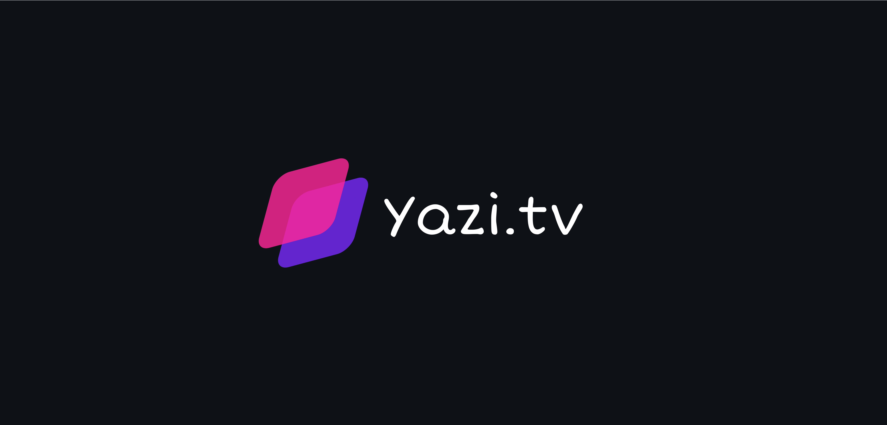

### Hi there! 👋

> Embark on an immersive streaming journey with Yazi.tv, your gateway to a treasure trove of movies and TV series. Dive into a world of endless entertainment options at your fingertips, watch in real-time with friends and family, host watch parties complete with interactive chat, receive handpicked recommendations tailored to your viewing habits, and download content for offline enjoyment.
>
> Yazi.tv seamlessly transitions from Figma prototype to a robust web application crafted with React, Next, and TypeScript. My primary focus was delivering pixel-perfect design and establishing a captivating brand visual identity. Following this goal, I've designed an intuitive and user-friendly interface to ensure the best possible experience for all users in multiple devices.
>
> Under the hood, the codebase reflects a commitment to industry best practices for React and Next.js. We've meticulously dissected the application into reusable components, fostering efficiency, maintainability and end-to-end testing with Cypress to guarantee a seamless and bug-free experience from start to finish.
>
> As I don't own Netflix, our movie source was [the movie db api](https://developer.themoviedb.org/reference/intro/getting-started) (God bless them), let's pretend it's a Netflix-level application, okay ? hahahaha

## What is inside?

-   [NextJS](https://nextjs.org/docs)
-   [ReactJS](https://reactjs.org)
-   [TypeScript](https://www.typescriptlang.org)
-   [Tailwind](https://tailwindcss.com/)
-   [Tailwind Scrollbar](https://www.npmjs.com/package/tailwind-scrollbar)
-   [Shadcn/ui](https://ui.shadcn.com/)
-   [Lucide Icons](https://lucide.dev/icons/)
-   [Axios](https://axios-http.com/ptbr/docs/intro)
-   [TMDB API](https://developer.themoviedb.org/reference/intro/getting-started)
-   [Cypress](https://www.cypress.io/)
-   [Eslint](https://eslint.org)
-   [Prettier](https://prettier.io)
-   [Husky](https://github.com/typicode/husky)
-   [Commitlint](https://commitlint.js.org/#/)

## Getting Started

### Install dependencies

```bash
pnpm install
```

or

```bash
yarn
```

or

```bash
npm install
```

### Run development server

```bash
pnpm dev
```

or

```bash
yarn dev
```

or

```bash
npm run dev
```

Open [http://localhost:3000](http://localhost:3000) with your browser to see the result.

## Structure

```
└── cypress
    ├── e2e
└── src
    ├── app
    ├── assets
    ├── components
        ├── content
        ├── movies
        ├── main-nav
        ├── ui
    ├── lib
    ├── utils
```

| Folder         | Description                                                               |
| -------------- | ------------------------------------------------------------------------- |
| **e2e**        | e2e tests in the app                                                      |
| **app**        | App pages                                                                 |
| **assets**     | Images and static files for application                                   |
| **components** | Pages components                                                          |
| **content**    | Components related to app content                                         |
| **movies**     | Components related to the movies                                          |
| **main-nav**   | Components related to the main navigation of the app (sidebar and drawer) |
| **ui**         | Reusable ui components                                                    |
| **lib**        | Configuration of libraries used in the project                            |
| **utils**      | Auxiliary and reusable functions                                          |

## Commands

-   `dev`: run development server
-   `build`: creates the production build version
-   `format`: run prettier and eslint in all the files
-   `cypress`: open cypress
-   `test`: run test file
-   `commit`: commit staged changes

## 🎨 Figma prototype

> [Ui prototype](https://www.figma.com/file/yzxjhxvefLVnC12xks7GP0/Yazi.tv?type=design&node-id=155%3A1234&mode=design&t=yYi6Ox1iN2DVGQVq-1)

## Todo

-   ❎ **More information about the movie on hover card**
-   [ ] **Buy Netflix for this app to become a real platform**
-   [ ] **Notifications widget**
-   [ ] **Messages widget**
-   [ ] **User's avatar menu**
-   [ ] **Page navigation**
-   [ ] **Search Input**

<p align="center">Made with 🤍 by Arthur</p>
